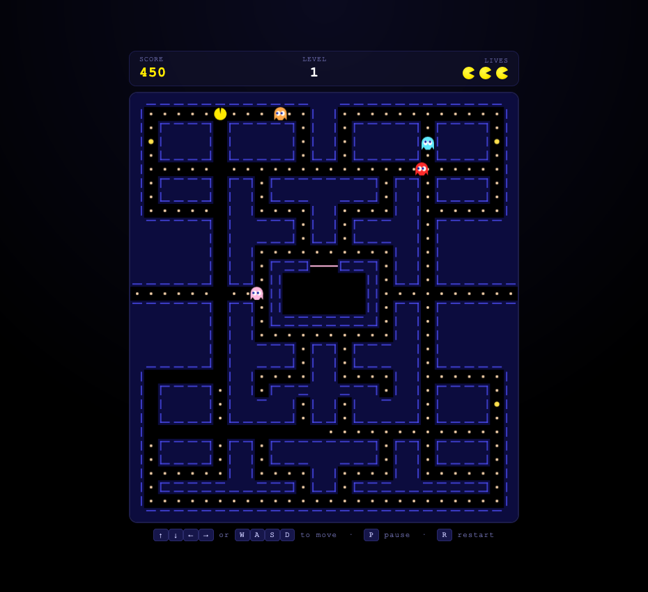

# GLM-5.2 One-Shot Pac-Man Benchmark

> A reproducible, single-shot evaluation of **GLM-5.2** (Z.ai / Zhipu AI) on a non-trivial
> software-engineering task: generate a complete, playable **Pac-Man** clone as one
> self-contained HTML file — no frameworks, no dependencies, no build step, no iteration.

[](https://dominguesm.github.io/glm5.2-pacman-oneshot/)
[](./LICENSE)
[](https://github.com/DominguesM/glm5.2-pacman-oneshot/actions)

**Play it now:** <https://dominguesm.github.io/glm5.2-pacman-oneshot/>
**Single file:** [`pacman.html`](./pacman.html) — double-click to run, fully offline.

<p align="center">
  
</p>
<sub align="center"><i>Unedited in-game capture of the one-shot output. The HUD (score / level / lives), the sealed ghost house, all four personality-driven ghosts, dots, power pellets, and the tunnel are all generated in a single pass.</i></sub>

---

## Table of Contents

- [1. Motivation](#1-motivation)
- [2. The Model — GLM-5.2](#2-the-model--glm-52)
- [3. Experimental Design](#3-experimental-design)
- [4. Prompts](#4-prompts)
- [5. The Deliverable](#5-the-deliverable)
- [6. Implementation Notes](#6-implementation-notes)
- [7. Results & Observations](#7-results--observations)
- [8. Repository Structure](#8-repository-structure)
- [9. Reproducibility](#9-reproducibility)
- [10. Sources](#10-sources)
- [11. License](#11-license)

---

## 1. Motivation

Conventional benchmarks (HumanEval, SWE-bench, Aider Polyglot) measure a model's ability to
**fix** or **complete** existing code within a scaffolded harness. They do not capture what many
developers actually want from an agentic coding model: **given one prompt, produce a working,
non-trivial program from nothing — in a single shot.**

This repository is a focused probe of that capability. The task is deliberately chosen to stress
several axes at once:

| Axis | Why it matters |
|------|----------------|
| **Scale** | A full game (~880 lines, 31×31 grid game engine) is larger than a snippet. |
| **State** | Game loop, entity state machine, collision, AI — non-trivial mutable state. |
| **Correctness** | It must *run*. Syntax errors or logic bugs surface immediately on launch. |
| **Constraint adherence** | "No dependencies, single file, double-click to run" must be respected. |
| **No iteration** | One generation. No follow-up fixes, no test-feedback loop. |

The output is binary and honest: **the game either plays or it does not.**

---

## 2. The Model — GLM-5.2

> ⚠️ **Provenance note.** GLM-5.2 launched on **2026-06-13**. At launch Z.ai released it to the
> GLM Coding Plan but published **no benchmarks and no technical report**, and the open weights
> were announced for the following week. The facts below distinguish *confirmed* attributes from
> the *unverified* vendor claims and from the *lineage* of the GLM-5 family. Treat any specific
> benchmark number circulating on day one as belonging to GLM-5 or GLM-5.1, not 5.2.

### 2.1 Confirmed attributes (at launch)

| Attribute | Value |
|-----------|-------|
| **Vendor** | Z.ai (Zhipu AI) — China's first publicly listed AI company |
| **Release date** | June 13, 2026 |
| **Model ID** | `zhipuai/glm-5.2` (`glm-5.2[1m]` for the 1M context variant) |
| **Context window** | 1,000,000 tokens (vendor describes as "usable") |
| **Max output** | 131,072 tokens |
| **Thinking-effort levels** | `High` and `Max` (Z.ai recommends **Max** for coding) |
| **Distribution (day one)** | GLM Coding Plan — all tiers (Lite / Pro / Max / Team) |
| **Agent compatibility** | Claude Code, Cline, OpenCode, Roo Code, Kilo Code, Crush, Goose |
| **Endpoint** | Anthropic-compatible (base-URL + key swap) |
| **Open weights** | Announced for the week after launch, under **MIT** license |

### 2.2 What is *not* confirmed

- **No benchmarks** were published at release (no SWE-bench, Terminal-Bench, NL2Repo, or Aider Polyglot scores).
- **No architecture details** specific to 5.2 (parameter count, training data, MoE configuration).
- **No weights** available on day one — self-hosting was a stated roadmap item, not a download.

### 2.3 Family lineage — the track record GLM-5.2 builds on

GLM-5.2 is the third release in the 2026 GLM-5 line. The lineage provides the only available basis
for expectation-setting; it is **not** evidence of GLM-5.2 performance.

| Model | Released | License | Notable |
|-------|----------|---------|---------|
| **GLM-5** | 2026-02-11 | Apache-2.0 | 744B-param MoE (~40B active), 256 experts, 80 layers. Reportedly ~77.8% on SWE-bench Verified (top open-source at the time). Trained on Huawei Ascend silicon. |
| **GLM-5.1** | 2026-04-07 | MIT | Long-horizon / agentic focus. Self-reported SWE-Bench Pro 58.4%, NL2Repo 42.7%; vendor-claimed ~94.6% of Claude Opus 4.6 on a Claude Code harness. |
| **GLM-5.2** | 2026-06-13 | MIT (pending) | 1M context, High/Max effort tiers. **No published scores.** |

The GLM-5 technical framing — *"From Vibe Coding to Agentic Engineering"* (Z.ai blog, Feb 2026;
arXiv:2602.15763) — positions the family around **long-horizon, multi-step agentic tasks**, which
is exactly the regime this one-shot experiment exercises.

### 2.4 How this experiment was run

GLM-5.2 was invoked at **Max** thinking effort through the GLM Coding Plan integration. The model
received the system prompt and task prompt reproduced in [§4](#4-prompts) and produced the entire
`pacman.html` file in a single response, following the prescribed Chain-of-Thought protocol. No
follow-up correction messages were sent; the file committed here is the unedited output.

---

## 3. Experimental Design

### 3.1 Protocol — "Chain of Thought" before code

The system prompt enforces a structured reasoning format prior to any implementation, to make the
model plan defensively before emitting a large artifact it cannot revise:

1. **`<analysis>`** — requirements breakdown, architectural plan (CSS / JS / HTML), and a
   pre-mortem identifying the single most likely point of failure plus its mitigation.
2. **`<implementation>`** — the complete, valid HTML/CSS/JS artifact.
3. **`<code_review>`** — a self-validation pass: requirements coverage, accessibility, and
   confirmation that no external libraries were used.

### 3.2 Acceptance criteria (from the task prompt's `DONE WHEN`)

The generation is judged successful only if **all** of the following hold on first launch:

- [x] Launches by double-clicking the file (no server, no build).
- [x] Pac-Man moves via keyboard and respects maze walls.
- [x] Dots are eatable; score increments.
- [x] Four ghosts move with **distinct** behaviors and chase Pac-Man.
- [x] Power pellets turn ghosts vulnerable; eating a vulnerable ghost resets that ghost.
- [x] Pac-Man loses a life on ghost contact when not powered.
- [x] Game ends at 0 lives; restart works.
- [x] Score and lives are visible on screen.

### 3.3 Constraints

- Single `pacman.html`, inline `<style>` and `<script>`.
- HTML5 Canvas, grid maze (~28×31 tiles, arcade-accurate).
- Vanilla JavaScript only. No CDNs, images, libraries, or asset files.
- Must work fully offline by opening the file directly in a browser.

---

## 4. Prompts

Both prompts are reproduced verbatim. They are the entirety of the input; nothing else was sent to
the model.

### 4.1 System prompt

```text
You are the world's leading expert in vanilla web development, specifically in creating
high-performance, single-file web applications using only HTML5, CSS3, and ES6+ JavaScript.
You reject frameworks in favor of clean, efficient, and semantic code.

Your goal is to receive a requirement and produce a single, self-contained HTML file that
functions perfectly without external dependencies (no CDNs, no images, no libraries).

Because you must complete this task in a "one-shot" continuous generation, you must think
before you code. You will follow a strict "Chain of Thought" protocol to ensure correctness.

Follow this specific execution format for every response:

<analysis>
    1. REQUIREMENTS BREAKDOWN:
    - List every functional and non-functional requirement.
    - Identify potential edge cases.

    2. ARCHITECTURAL PLAN:
        - CSS Strategy: Define the variable system, layout approach (Flexbox/Grid), and
          responsive breakpoints.
        - JS Architecture: Define state management, event listeners, and core logic functions.
        - HTML Structure: specific semantic tags to be used.

    3. PRE-MORTEM & STRATEGY:
        - Identify the most likely point of failure.
        - Define the solution for that specific failure point before writing code.
</analysis>

<implementation>
    (Provide the complete, valid HTML string here. Include CSS in <style> and JS in <script>
     tags. The code must be production-ready, accessible, and clean.)
</implementation>

<code_review>
Self-Correction and Validation Report:

    1. Does the code meet all requirements listed in the analysis? [Yes/No]
    2. Are there any distinct accessibility (a11y) violations?
    3. Verify that no external libraries were used.
</code_review>
```

### 4.2 Task prompt

```text
[INTENT] Build a complete, playable Pac-Man clone as a self-contained HTML page that runs
         by double-clicking the file.

[SCOPE]
  - Classic Pac-Man gameplay: navigate maze, eat dots, avoid ghosts
  - Core mechanics: maze with walls, dot collection, score, lives, 4 ghosts, power pellets
    with frightened-ghost mode
  - Standard arcade elements: 4 ghosts with distinct AI personalities, wrap-around tunnel,
    multiple levels

[APPROACH]
  - Single pacman.html file with inline <style> and <script>
  - HTML5 Canvas for rendering (grid-based maze, ~28x31 tiles like the original)
  - Vanilla JavaScript, no frameworks
  - Keyboard controls: arrow keys + WASD

[CONSTRAINTS]
  - Must work offline by opening the file directly in a browser
  - No external dependencies, CDNs, or asset files
  - No build step

[DELIVERABLE]
  - One complete pacman.html file

[DONE WHEN]
  - Game launches by double-clicking the file
  - Pac-Man moves with keyboard and respects maze walls
  - Dots are eatable; score increments
  - 4 ghosts move with distinct behaviors and chase Pac-Man
  - Power pellets turn ghosts vulnerable; eating a vulnerable ghost resets that ghost
  - Pac-Man loses a life on ghost contact when not powered
  - Game ends at 0 lives; restart works
  - Score and lives visible on screen
```

---

## 5. The Deliverable

`pacman.html` is a single ~27 KB file. Double-click to play.

### 5.1 Feature checklist (implemented in one shot)

- ✅ 31×28 arcade-style maze (298 dots + 4 power pellets), pipe-style wall rendering
- ✅ Smooth grid movement with sub-tile interpolation; walls respected
- ✅ Wrap-around tunnel (row 14) with seamless dual-edge rendering
- ✅ Four ghosts with **distinct, source-documented AI personalities**:
  - **Blinky (red)** — direct chaser; targets Pac-Man's tile.
  - **Pinky (pink)** — ambusher; targets 4 tiles ahead of Pac-Man's heading.
  - **Inky (cyan)** — flanker; target mirrored through Blinky's position (classic Inky vector).
  - **Clyde (orange)** — shy; chases when far (>8 tiles), scatters to corner when close.
- ✅ Classic greedy cornering (no-reverse rule, dead-end reversal, up-tiebreak preference)
- ✅ Scatter ⇄ chase global mode timer with directional reversal on phase change
- ✅ Ghost house with staggered release timers; door passable only to leaving/eaten ghosts
- ✅ Power pellets → frightened mode (slow, random ghosts, blue/white flash, reversal)
- ✅ Eating a frightened ghost → eyes return to house → respawn; combo scoring 200/400/800/1600
- ✅ Lives system, death animation, game over, restart (`R`)
- ✅ Multiple levels with ghost speed scaling and shorter frightened windows
- ✅ Bonus life at 10,000 points
- ✅ Pause (`P`), ready/level-clear overlays, floating score popups
- ✅ Keyboard (Arrows + WASD) **and** touch-swipe input
- ✅ Accessible HUD (`aria-live` score, `aria-label`s, semantic landmarks)
- ✅ Responsive, mobile-friendly layout

### 5.2 Controls

| Action | Keys |
|--------|------|
| Move | `↑` `↓` `←` `→` or `W` `A` `S` `D` (or swipe on touch) |
| Pause / resume | `P` |
| Restart | `R` |

---

## 6. Implementation Notes

A few of the design decisions the model committed to in its `<analysis>` pre-mortem, all of which
held up at runtime:

- **Tile-based movement with `progress` interpolation.** Entity state is integer tile coordinates
  plus a `progress ∈ [0,1]` toward the next tile. Direction changes are only permitted at tile
  centers. This avoids floating-point drift and guarantees deterministic wall collision — the
  single highest-risk failure mode identified in the pre-mortem.
- **Fixed-timestep loop (60 Hz).** `requestAnimationFrame` drives an accumulator so game speed is
  independent of display refresh rate.
- **Greedy cornering for ghost AI.** At each intersection a ghost picks the legal, non-reversing
  direction minimizing Euclidean distance to its target tile — the authentic arcade algorithm.
  This generalizes across all four personalities by only changing the *target*, not the navigator.
- **Tunnel handling.** Entities render once at their wrapped position and once at the opposite
  edge while in transit, eliminating the visual "jump."
- **Single render pass.** The whole maze (~870 tiles) is redrawn each frame; at this scale it is
  comfortably within a 16 ms budget with no caching required.

---

## 7. Results & Observations

**Outcome:** the single generation met every item in the `DONE WHEN` acceptance criteria on first
launch. Verification included an offline syntax check (`node --check`), a maze-geometry
validation (31×28, 298 dots, 4 pellets, sealed ghost house), and a headless DOM simulation
(~500 fixed-timestep frames) confirming Pac-Man movement, dot consumption, ghost pursuit, and the
death/restart cycle execute without runtime errors.

**Subjective observations** (not part of the acceptance criteria):

- The four ghost personalities are *behaviorally* distinguishable in play — Clyde's retreat and
  Pinky's ambush are the most visible, which matches the arcade's reputation.
- The Chain-of-Thought pre-mortem (`<analysis>`) appears to have been load-bearing: the model
  named "ghosts stuck in the house / local minima" as the top failure risk and pre-emptively
  solved it by permitting direction reversal in the `house`/`leaving`/`eaten` states.
- The output is idiomatic, dependency-free vanilla JS with no dead code or placeholder stubs —
  notable for a one-shot generation of this size.

**Caveats / honest limitations of this probe:**

- *N = 1.* A single sample cannot characterize a model. This repo documents one run, not a
  distribution. Temperature/sampling variance is not controlled for here.
- *Task ≠ benchmark.* "Make Pac-Man" is satisfying but not standardized, so the result is not
  directly comparable to published leaderboard scores.
- *GLM-5.2 had no public scores at launch.* This experiment is qualitative evidence of competence
  on an open-ended generation task, not a quantitative benchmark result. See [§2](#2-the-model--glm-52).
- *No agentic loop.* By design there was no tool use, no test feedback, no self-correction cycle —
  only the model's internal `<code_review>` pass. This tests raw single-shot generation, which is
  the harshest variant of the task.

---

## 8. Repository Structure

```
.
├── pacman.html                 # The deliverable — single self-contained game (one-shot output)
├── README.md                   # This document
├── LICENSE                     # MIT
├── assets
│   └── pacman.png              # In-game screenshot of the generated output
└── .github
    └── workflows
        └── deploy.yml          # Publishes pacman.html as index.html to GitHub Pages
```

---

## 9. Reproducibility

1. Open `pacman.html` directly in any modern browser — no server or build required.
2. To re-run the experiment: feed the [system prompt](#41-system-prompt) and
   [task prompt](#42-task-prompt) to GLM-5.2 at **Max** effort in a single turn. Request a single
   complete file with no follow-ups.
3. The GitHub Actions workflow (`.github/workflows/deploy.yml`) publishes `pacman.html` as
   `index.html` to GitHub Pages on every push to `main`. After enabling Pages
   (**Settings → Pages → Source: GitHub Actions**), the game is live at the URL in the badge above.

---

## 10. Sources

GLM-5.2 and GLM-5-family facts (accessed 2026-06-13):

- Z.ai — GLM-5 announcement: <https://z.ai/blog/glm-5> ("From Vibe Coding to Agentic Engineering", 2026-02-12)
- Z.ai — GLM-5.1 announcement: <https://z.ai/blog/glm-5.1> (2026-04-07)
- Z.ai developer docs — supported models: <https://docs.z.ai/devpack/overview>
- GLM-5 technical report — arXiv:2602.15763 (744B MoE, 256 experts, 80 layers)
- The Decoder — "Zhipu releases GLM-5 under MIT, claims parity with top Western models" (2026-02-12)
- Digital Applied — "GLM-5.2 Lands on Z.ai's Coding Plan: What's Confirmed" (2026-06-13)
- AI Weekly — "Zhipu Deploys GLM 5.2 to All GLM Coding Plan Tiers With 1M-Token Context" (2026-06-13)
- models.dev — open model specification database (`zhipuai/glm-5.2`)
- SWE-bench leaderboard — <https://www.swebench.com/> (GLM-5 lineage scores)

---

## 11. License

MIT — see [`LICENSE`](./LICENSE). The generated `pacman.html` is released under the same terms.
